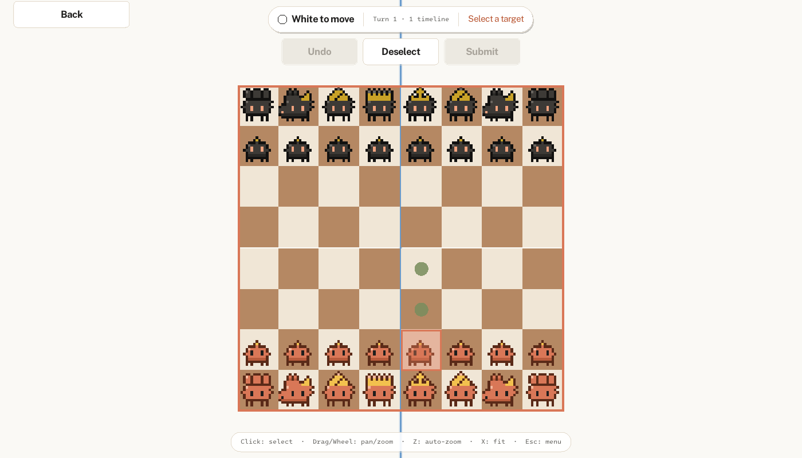

# 5D Chess Game

A modern implementation of multidimensional chess featuring timeline mechanics, built with C++ and Raylib graphics library.

**Play in your browser: <https://llaammtteerr.github.io/5DChess/>** (available after the next release; the web build has no background music).



## Table of Contents
- [Overview](#overview)
- [Screenshots](#screenshots)
- [Prerequisites](#prerequisites)
- [Installation](#installation)
- [Building](#building)
- [Running](#running)
- [Project Structure](#project-structure)
- [Controls](#controls)
- [Features](#features)
- [Troubleshooting](#troubleshooting)
- [Contributing](#contributing)

## Overview

This project implements a 5D Chess game with an advanced UI system featuring:
- Multi-timeline chess mechanics
- Interactive board visualization with highlighting and an auto-focusing camera
- Dynamic menu system with hierarchical navigation
- In-turn undo, deselect and submit controls (command pattern for menu actions)
- State-driven scene management
- Modular rendering pipeline

## Screenshots

<table>
  <tr>
    <td width="50%"><br><sub>Timeline Battle: nine timelines branching from the start.</sub></td>
    <td width="50%"><br><sub>Settings: choose a piece theme (Pixel selected).</sub></td>
  </tr>
</table>

## Prerequisites

- A C++20 compiler (GCC 11+, Clang 14+, or MSVC 2022)
- CMake 3.28 or newer
- Git is not required to build; raylib 5.5 is downloaded automatically by CMake
  (a system-installed raylib >= 5.0 is used instead if found)

### Linux (Debian/Ubuntu)
```bash
sudo apt-get install -y build-essential cmake libx11-dev libxrandr-dev libxinerama-dev libxcursor-dev libxi-dev libgl1-mesa-dev libasound2-dev
```

### macOS
Install the Xcode Command Line Tools (`xcode-select --install`) and CMake (`brew install cmake`).
`brew install raylib` is optional: CMake fetches raylib itself when it is not installed.

### Windows
Install Visual Studio 2022 (Desktop development with C++) and CMake. Use a
"Developer PowerShell" or any shell with `cmake` on the PATH.

## Installation

```bash
git clone https://github.com/LLaammTTeerr/5DChess.git
cd 5DChess
```

## Building

```bash
cmake -S . -B build -DCMAKE_BUILD_TYPE=Release
cmake --build build --config Release -j
```

On Windows (MSVC, multi-config generator) use the same two commands; the binary ends up in `build/Release/`.
Assets are copied next to the executable after every build.

### Web build

A WebAssembly build (emsdk 4.0.10, raylib's Web platform) runs in the browser. It needs CMake 3.28+, so with the
`emscripten/emsdk` image install a newer CMake first (`pip install cmake`):

```bash
emcmake cmake -S . -B build-web -DCMAKE_BUILD_TYPE=Release -DFDCHESS_BUILD_TESTS=OFF
cmake --build build-web -j
python3 -m http.server 8765 -d build-web   # then open http://localhost:8765/5dchess.html
```
Only the assets the game loads are bundled; `assets/backgroundmusic` is excluded. Releases are deployed to GitHub Pages by `.github/workflows/pages.yml`.

### CMake options

| Option | Default | Meaning |
| --- | --- | --- |
| `FDCHESS_BUILD_GAME` | ON | Build the raylib game (`5dchess`) |
| `FDCHESS_BUILD_TESTS` | ON | Build the unit/property tests (doctest) |
| `FDCHESS_SANITIZE` | OFF | Enable AddressSanitizer + UBSan (GCC/Clang) |

### Tests
```bash
cmake -S . -B build-test -DCMAKE_BUILD_TYPE=Debug -DFDCHESS_BUILD_GAME=OFF -DFDCHESS_SANITIZE=ON
cmake --build build-test -j
ctest --test-dir build-test --output-on-failure
```
The engine tests do not need raylib or a display. Drop `-DFDCHESS_SANITIZE=ON` for a plain run.

### Packaging
```bash
cmake --build build --config Release
cmake --build build --config Release --target package   # produces 5DChess-<version>-<platform>.zip
```

### Releasing
1. Bump `VERSION` in the `project()` call of `CMakeLists.txt`.
2. Update `CHANGELOG.md` (move `[Unreleased]` entries under the new version).
3. Tag and push: `git tag vX.Y.Z && git push origin vX.Y.Z`.

The release workflow checks that the tag matches `VERSION`, builds on Linux/macOS/Windows, and publishes the ZIPs to a GitHub Release.

## Running

```bash
./build/5dchess            # Linux/macOS
.\build\Release\5dchess.exe   # Windows
```
The game changes its working directory to the executable's folder, so it can be launched from anywhere.

## Project Structure

```
5DChess/
├── CMakeLists.txt             # Build, install and CPack configuration
├── CHANGELOG.md               # Release notes
├── .github/                   # CI, release workflows and Dependabot config
├── assets/                    # Game assets
│   ├── images/                # Piece and board textures
│   ├── fonts/                 # Custom fonts
│   ├── backgroundmusic/       # Audio files
│   ├── soundeffect/           # Sound effects
│   └── buttons/               # UI button graphics
├── include/                   # Header files
│   ├── Commands/              # Menu and in-game commands (Command pattern)
│   ├── GameStates/            # State pattern for game flow
│   ├── Menu/                  # Menu system (Composite pattern)
│   ├── Render/                # Rendering and view components
│   └── Scene/                 # Scene management
├── src/                       # Source files
│   ├── Commands/
│   ├── GameStates/
│   ├── Menu/
│   ├── Render/
│   ├── Scene/
│   ├── main.cpp               # Entry point
│   └── chess.cpp              # Core rules engine (no raylib dependency)
├── tests/                     # doctest unit and property tests for the engine
└── README.md                  # This file
```

## Controls

### Menu Navigation
- **Mouse**: Click to select menu items
- **Hover**: Visual feedback on interactive elements

### Game Controls
- **Mouse Click**: Select a piece, then click a highlighted square to move (hovering a square only tints it; legal targets appear after selecting a piece)
- **Drag / Mouse Wheel**: Pan and zoom the camera
- **In-game Menu**: Undo, Deselect and Submit buttons (greyed out when unavailable)

### Keyboard Shortcuts
- **ESC / Space**: Toggle the navigation menu (shown by default, with Back to return to game selection)
- **Z**: Toggle camera auto-zoom
- **X**: Fit the boards in view (manual auto-zoom)

## Features

### Core Gameplay
- **5D Chess Mechanics**: Move pieces across time and parallel universes
- **Timeline Visualization**: Clear representation of temporal moves
- **Legal Move Highlighting**: Visual guides for valid moves
- **Undo**: Take back moves within the current turn before submitting (no redo)

### User Interface
- **Dynamic Menus**: Context-sensitive navigation
- **Multiple View Modes**: Button and list-based menu layouts
- **Camera**: Smooth auto-centering and auto-zoom, plus manual pan and zoom
- **Responsive Design**: Adaptive layouts for different screen sizes
- **Warm cream + terracotta theme**: shared design tokens (`include/Render/UITheme.h`), rounded buttons with smooth hover and a pointing-hand cursor, a status HUD (side to move, turn, next-step hint), a controls hint bar and an end-of-game card

### Audio
- **Background music**: pick a track in Settings → Music (default: Off, so the game starts silent). The choice is global and persists across scenes; the track is streamed and starts after your first click.
- **Sound effects**: move, capture, game won and menu-button clicks; toggle them with "Sound effects" in Settings → Music. Check, castle, promotion and draw sounds are bundled but wait for those rules to exist.
- Without an audio device the game runs silently.

### Piece Themes
Four piece themes are available: Classic, Modern, Fantasy and Pixel. Choose one in Settings → Piece Theme. Pixel is an original pixel-art theme generated by `python3 scripts/gen_pixel_theme.py` (requires Pillow); `--out DIR` sets the output directory (default `assets/images/Theme_3`) and `--sheet PATH` writes a preview contact sheet.


### Developer Tools
Configure with `-DFDCHESS_BUILD_TOOLS=ON` to also build `theme_preview`, which renders a scripted game and saves a screenshot:
```bash
theme_preview <Classic|Modern|Fantasy|Pixel> <Standard|Battle|Invasion|Fragment> <out.png> [turns]
```
`turns` defaults to 2.

### Technical Features
- **Modular Architecture**: Clean separation of concerns (MVC pattern)
- **Design Patterns**: Command, State, Strategy, Composite, Singleton
- **Resource Management**: Efficient asset loading and caching
- **Extensible Framework**: Easy addition of new features and game modes

## Troubleshooting

### Build issues

- **`raylib.h`/X11/GL headers missing on Linux**: install the apt packages listed under Prerequisites.
- **CMake too old** (`cmake_minimum_required` error): install CMake 3.28+ (`pip install cmake` or Kitware's apt repository).
- **raylib download fails (offline/proxy)**: install raylib >= 5.0 system-wide (`brew install raylib`, or your distro package) and re-run CMake with a clean build directory.
- **Stale configuration**: delete the build directory and configure again.

### Runtime issues

- **Missing assets**: the `assets/` folder must sit next to the executable. CMake copies it after the build; packaged ZIPs include it.
- **Window doesn't open**: check graphics drivers (OpenGL 3.3 is required). Headless machines need a display, e.g. `xvfb-run -a ./build/5dchess`.
- **Performance issues**: lower the FPS limit in `main.cpp` or reduce texture sizes in `assets/images/`.

## Contributing

1. Fork the repository
2. Create a feature branch (`git checkout -b feature/amazing-feature`)
3. Commit your changes (`git commit -m 'Add amazing feature'`)
4. Push to the branch (`git push origin feature/amazing-feature`)
5. Open a Pull Request

### Code Style
- Use C++20 standards
- Follow the existing naming conventions
- Document new classes and methods
- Maintain the established design patterns

### Testing
- Run `ctest` (see Tests above) before submitting; CI runs it on Linux, macOS and Windows
- Verify all menu interactions work correctly
- Ensure no memory leaks with new features

## License

This project is part of an academic assignment for Object-Oriented Programming course.

## Acknowledgments

- **Raylib**: Graphics and audio library
- **HCMUS**: University of Science, VNU-HCM
- **Course**: Object-Oriented Programming (OOP)

---

For questions or issues, please open an issue on the GitHub repository or contact the development team.
