# 5DChess

Chess with multiverse time travel: a 5D Chess game with timelines, built in C++20 with raylib, for desktop and the browser.

[](https://github.com/LLaammTTeerr/5DChess/actions/workflows/ci.yml)
[](https://github.com/LLaammTTeerr/5DChess/releases/latest)
[](https://github.com/LLaammTTeerr/5DChess/actions/workflows/pages.yml)

**▶ Play in your browser: <https://chess.lamter.cc/>**

**⬇ Download for Linux/macOS/Windows: <https://github.com/LLaammTTeerr/5DChess/releases/latest>**

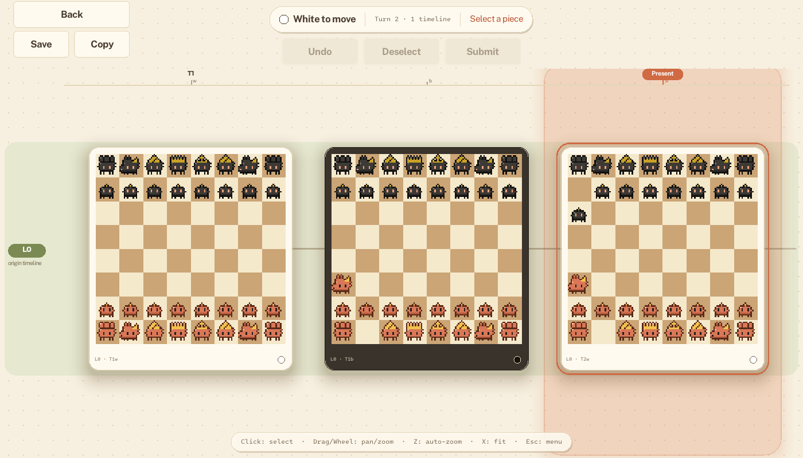

## Table of Contents
- [Overview](#overview)
- [Screenshots](#screenshots)
- [Puzzles](#puzzles)
- [Prerequisites](#prerequisites)
- [Installation](#installation)
- [Building](#building)
- [Running](#running)
- [Project Structure](#project-structure)
- [Controls](#controls)
- [Features](#features)
- [Roadmap](#roadmap)
- [Known limitations](#known-limitations)
- [Troubleshooting](#troubleshooting)
- [Contributing](#contributing)

## Overview

This project implements a 5D Chess game with an advanced UI system featuring:
- Multi-timeline chess mechanics
- **Play vs Computer**: an AI opponent (Easy, Normal, Hard) that plays whole turns across timelines, as White or Black, on every game mode
- **Puzzles**: fourteen original, engine-proven mates in one and two, including time-travel and branching mates
- An interactive Guide: ten short lessons on live boards, with things to try
- Save and load: autosave with Continue, three save slots, copy/paste of game records
- Six original piece themes generated by code (Pixel, Medieval, Bauhaus, Neon, Origami, Ink)
- Three board views (Atlas by default, Deep space, Blueprint) that show every timeline at once: lanes, a turn ruler, the present, branches and time-travel jumps
- Interactive board visualization with highlighting and a calm camera: Overview / Focus / Free, click-to-focus, keyboard navigation
- Small widget layer (buttons, lists, toggles) and a screen stack with cross-fades
- In-turn undo, deselect and submit controls
- One `Screen` per page (main menu, mode select, settings, game), navigated with direct calls
- Modular rendering pipeline

## Screenshots

The default look is Pixel pieces on the Atlas board view; both are changed in Settings (a saved choice wins). Three board views, selectable in Settings -> Display -> *Board view* (the same Standard game in each):

<table>
  <tr>
    <td width="33%">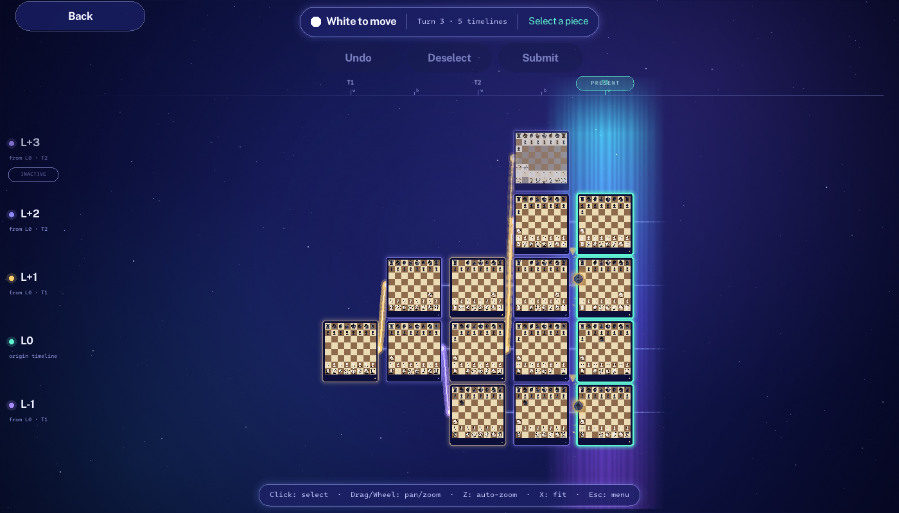<br><sub><b>Deep space</b>: glow encodes state; luminous branches in gold or violet by who branched.</sub></td>
    <td width="33%">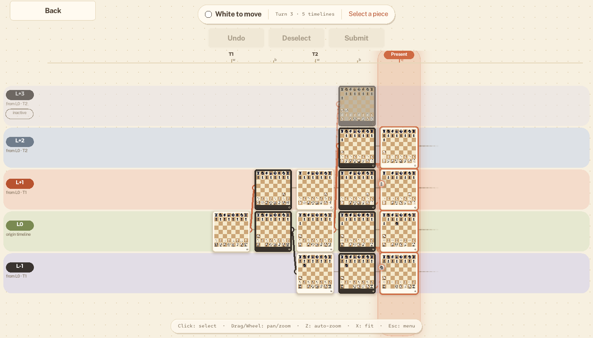<br><sub><b>Atlas</b> (default): a paper map with tinted lanes, card boards and a terracotta present.</sub></td>
    <td width="33%">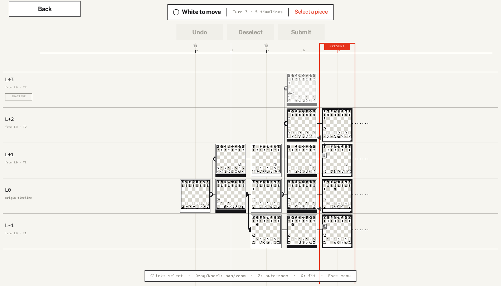<br><sub><b>Blueprint</b>: ink on off-white, elbow connectors, colour only for what needs attention.</sub></td>
  </tr>
</table>

Official-rules visuals: a board's frame says whether you must move on it (mandatory), may (optional) or not (history); inactive timelines are dimmed and tagged; a check draws a pulsing line from every attacker to the king; promotion opens a piece picker.

<table>
  <tr>
    <td width="50%">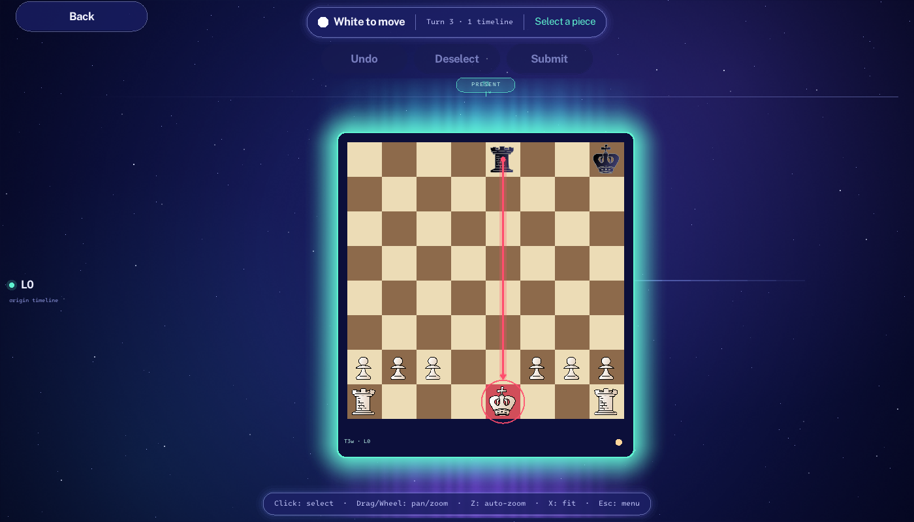<br><sub>Check: the attack line (it stays still under Reduce motion).</sub></td>
    <td width="50%">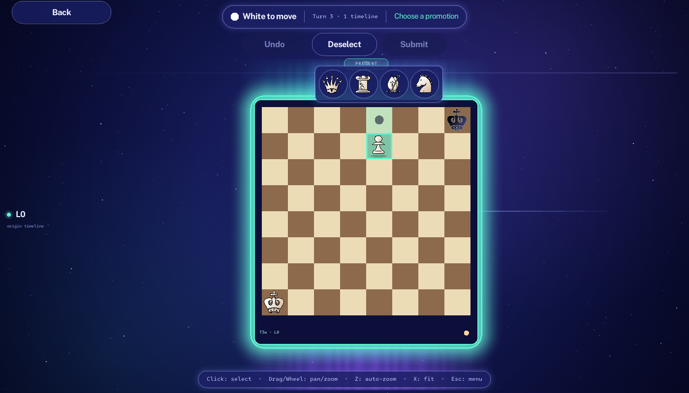<br><sub>Promotion: choose Queen, Rook, Bishop or Knight (Q / R / B / N).</sub></td>
  </tr>
</table>

Play against the computer: Versus -> Opponent: **Computer**, then your side and the level, then the mode. While it thinks the HUD says so and shows a progress bar (it moves every few seconds at most on Hard; the window stays responsive).

<table>
  <tr>
    <td width="50%">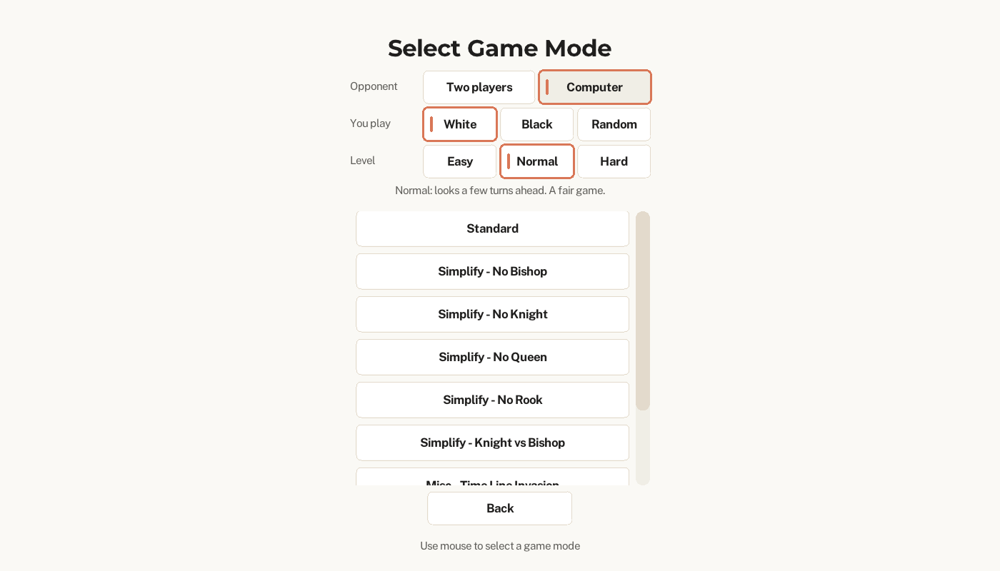<br><sub>Versus -> Computer: your side (White, Black or Random), the level (Easy, Normal, Hard) and then the mode.</sub></td>
    <td width="50%">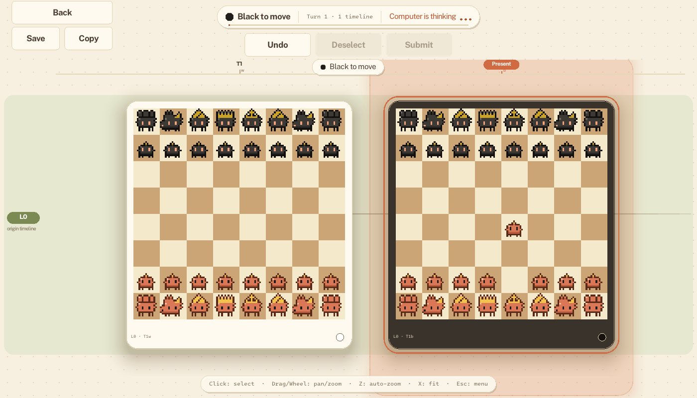<br><sub>"Computer is thinking" with a progress bar; the boards only pan and zoom until it has moved.</sub></td>
  </tr>
</table>

## Puzzles

Main menu -> **Puzzles**: fourteen original puzzles in three tiers, White to move, each **proved by the engine** (`tools/puzzle_check` tries every legal turn; a ctest guards the set). **Warm-up** (mates in 1 on one board), **Time travel** (mates in 1 that need a time jump or a move across timelines) and **Deep** (mates in 2, where the engine picks Black's reply, and "branching" mates that create a timeline). Any turn that mates is accepted, not only the stored one; Hint shows the idea and then rings the piece to move, Show solution plays it through, and solved puzzles keep a check mark (saved like the settings). See [docs/PUZZLES.md](docs/PUZZLES.md) for the file format and how to add one.

<table>
  <tr>
    <td width="50%">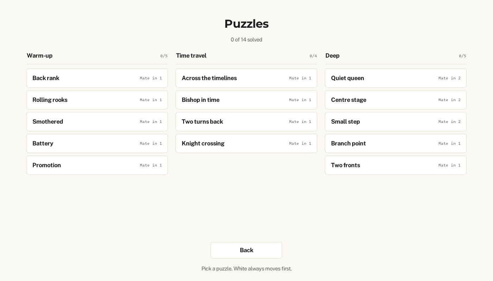<br><sub>The list: three tiers, goals and check marks.</sub></td>
    <td width="50%">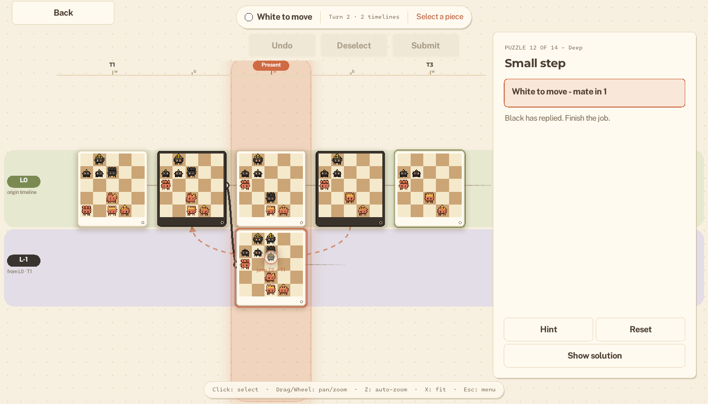<br><sub>A mate in 2: the engine has replied, now deliver the mate.</sub></td>
  </tr>
</table>

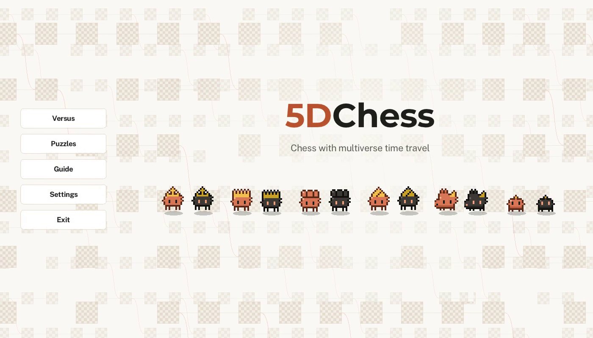

*The main menu.*

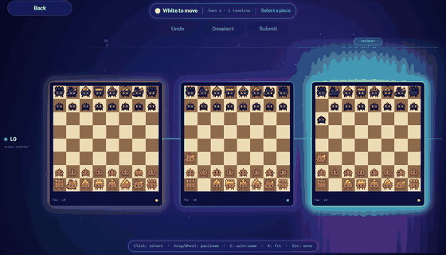

*Pieces slide, new boards grow in, and a banner announces the next turn.*

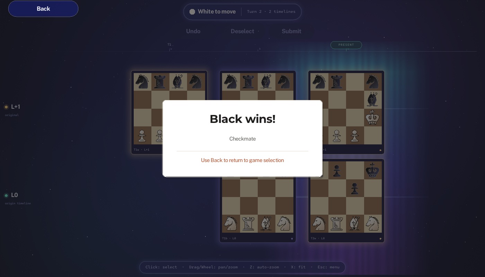

*The game ends on checkmate; no legal turn without check is a stalemate (draw).*

<table>
  <tr>
    <td width="50%">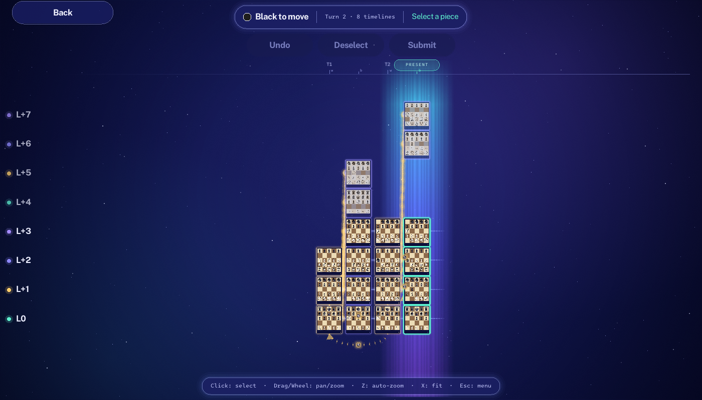<br><sub>Timeline Battle: eight timelines branching from the start.</sub></td>
    <td width="50%">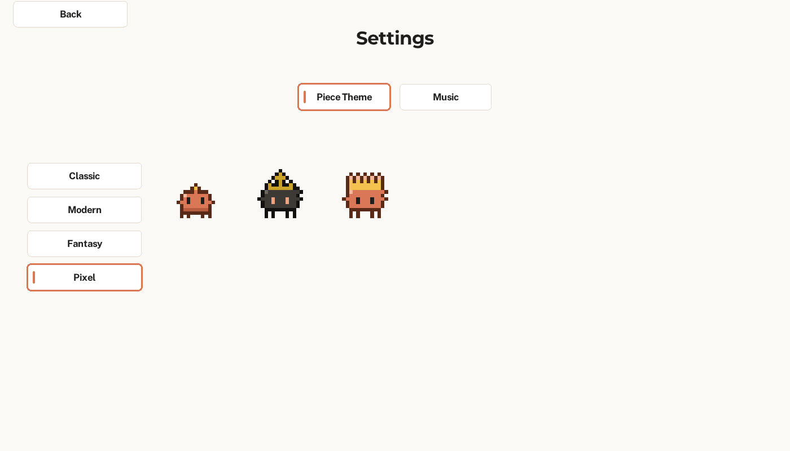<br><sub>Settings -> Display: board view and Reduce motion (settings are saved).</sub></td>
  </tr>
</table>

## Prerequisites

- A C++20 compiler (GCC 11+, Clang 14+, or MSVC 2022)
- CMake 3.28 or newer
- Git is not required to build; raylib 5.5 is downloaded automatically by CMake
  (a system-installed raylib >= 5.0 is used instead if found)

### Linux (Debian/Ubuntu)
```bash
sudo apt-get install -y build-essential cmake libx11-dev libxrandr-dev libxinerama-dev libxcursor-dev libxi-dev libgl1-mesa-dev libasound2-dev
```

### macOS
Install the Xcode Command Line Tools (`xcode-select --install`) and CMake (`brew install cmake`).
`brew install raylib` is optional: CMake fetches raylib itself when it is not installed.

### Windows
Install Visual Studio 2022 (Desktop development with C++) and CMake. Use a
"Developer PowerShell" or any shell with `cmake` on the PATH.

## Installation

```bash
git clone https://github.com/LLaammTTeerr/5DChess.git
cd 5DChess
```

## Building

```bash
cmake -S . -B build -DCMAKE_BUILD_TYPE=Release
cmake --build build --config Release -j
```

On Windows (MSVC, multi-config generator) use the same two commands; the binary ends up in `build/Release/`.
Assets are copied next to the executable after every build.

### Web build

A WebAssembly build (emsdk 4.0.10, raylib's Web platform) runs in the browser. It needs CMake 3.28+, so with the
`emscripten/emsdk` image install a newer CMake first (`pip install cmake`):

```bash
emcmake cmake -S . -B build-web -DCMAKE_BUILD_TYPE=Release -DFDCHESS_BUILD_TESTS=OFF
cmake --build build-web -j
python3 -m http.server 8765 -d build-web   # then open http://localhost:8765/5dchess.html
```
Only the assets the game loads are bundled (including the audio); the web build has no Exit menu item. Releases are deployed to GitHub Pages by `.github/workflows/pages.yml`.

### CMake options

| Option | Default | Meaning |
| --- | --- | --- |
| `FDCHESS_BUILD_GAME` | ON | Build the raylib game (`5dchess`) |
| `FDCHESS_BUILD_TESTS` | ON | Build the unit/property tests (doctest) |
| `FDCHESS_SANITIZE` | OFF | Enable AddressSanitizer + UBSan (GCC/Clang) |
| `FDCHESS_BUILD_REFCHECK` | OFF | Build `tools/refcheck` (differential testing against 5d-chess-js, search benchmark) |

### Tests
```bash
cmake -S . -B build-test -DCMAKE_BUILD_TYPE=Debug -DFDCHESS_BUILD_GAME=OFF -DFDCHESS_SANITIZE=ON
cmake --build build-test -j
ctest --test-dir build-test --output-on-failure
```
The engine tests do not need raylib or a display. Drop `-DFDCHESS_SANITIZE=ON` for a plain run.

### Engine docs and differential testing
- [docs/RULES.md](docs/RULES.md): the rules the engine implements, their sources, and the deliberate differences from the
  reference engine 5d-chess-js.
- [docs/POSITIONS.md](docs/POSITIONS.md): the `.5dp` position file format used by the nine game modes (`assets/positions/`).
- [docs/NOTATION.md](docs/NOTATION.md): move notation (`(L0T1)e2>(L0T1)e4`) and the `5dchess-record` game record format.
- [docs/SEARCH.md](docs/SEARCH.md): how checkmate / stalemate are decided without blocking the game (the resumable
  `TurnSearch`), why its pruning is safe, and the benchmark (`turnbench`).
- [docs/AI.md](docs/AI.md): the AI opponent engine (`ai::Search`): turn generation, search,
  evaluation, difficulty levels, benchmark (`tools/ai_bench`), and how the game screen runs it a few milliseconds a frame.
- `tools/refcheck/` (`-DFDCHESS_BUILD_REFCHECK=ON`, default OFF): plays random legal games, dumps every position with its full
  move list and replays them in 5d-chess-js (`node tools/refcheck/compare.js --ref <5d-chess-js checkout> --bin <refcheck>`).

### Packaging
```bash
cmake --build build --config Release
cmake --build build --config Release --target package   # produces 5DChess-<version>-<platform>.zip
```

### Releasing
1. Bump `VERSION` in the `project()` call of `CMakeLists.txt`.
2. Update `CHANGELOG.md`: move the `[Unreleased]` entries under a new `## [X.Y.Z] - date` heading, optionally with a short summary paragraph on top. This section becomes the release notes.
3. Tag and push: `git tag vX.Y.Z && git push origin vX.Y.Z`.

The release workflow checks that the tag matches `VERSION` and that `CHANGELOG.md` has a `## [X.Y.Z]` section, builds on Linux/macOS/Windows, and publishes the ZIPs to a GitHub Release. The release notes are that CHANGELOG section (`scripts/changelog_section.sh X.Y.Z` prints it), a play/download line, and GitHub's list of merged PRs.

## Running

```bash
./build/5dchess            # Linux/macOS
.\build\Release\5dchess.exe   # Windows
```
The game changes its working directory to the executable's folder, so it can be launched from anywhere.

## Project Structure

```
5DChess/
├── CMakeLists.txt             # Build, install and CPack configuration
├── CHANGELOG.md               # Release notes
├── .github/                   # CI, release workflows and Dependabot config
├── assets/                    # Game assets
│   ├── images/                # Piece and board textures
│   ├── fonts/                 # Custom fonts
│   ├── backgroundmusic/       # Audio files
│   └── soundeffect/           # Sound effects
├── include/                   # Header files
│   ├── engine/                # Value API, .5dp positions, GameCatalog (no raylib)
│   ├── puzzles/               # Puzzle files and catalog, the exhaustive proofs (Solver), solved-state text (no raylib)
│   ├── services/              # Assets, settings, saved games (SaveStore) and other app services
│   ├── play/                  # The game screen's parts: Selection, BoardLayout, MultiverseView, BoardStyle, BoardScene, BoardRenderer, MoveAnimator, BoardCamera, Hud, TimelineArrows, PromotionPicker
│   ├── Render/                # Motion tokens, UI theme, piece themes
│   ├── Screens/               # One Screen per page of the game
│   └── ui/                    # Widget layer and the Screen / ScreenStack model
├── src/                       # Source files
│   ├── play/
│   ├── Render/
│   ├── engine/                # Rules engine implementation
│   ├── services/
│   ├── App.cpp                # App context (assets, audio, settings, screens)
│   ├── Screens/               # MainMenuScreen, ModeSelectScreen, SettingsScreen, PlayScreen
│   ├── ui/                    # Widgets (Button, ButtonList, Toggle, layout) and ScreenStack
│   ├── main.cpp               # Entry point
│   └── chess.cpp              # Core rules engine (no raylib dependency)
├── tests/                     # doctest unit and property tests for the engine
│   └── ui/                    # UI screenshot tests (scripts, baselines)
├── tools/                     # theme_preview, ui_script, puzzle_check (the puzzle prover), refcheck (differential tests against 5d-chess-js)
├── docs/                      # RULES.md, SEARCH.md, POSITIONS.md, NOTATION.md, PUZZLES.md, screenshots
└── README.md                  # This file
```

## Controls

### Menu Navigation
- **Mouse**: Click to select menu items
- **Hover**: Visual feedback on interactive elements
- **Main menu**: *Continue* (only while an unfinished autosave exists), *Versus* (two players at one screen, or the computer), *Load game*; the Load screen lists the three slots (empty ones are disabled) with a Delete button each and, on desktop, *Paste record*

### Game Controls
- **Mouse Click**: Select a piece, then click a highlighted square to move (hovering a square only tints it; legal targets appear after selecting a piece); a pawn reaching the last rank opens the promotion picker (or press Q / R / B / N). When the boards are small (zoom below 0.8) the click also brings that board up to a readable size, in one motion
- **Click a board's frame or label**, or any square of a board that is history: focus that board (zoom 1.0)
- **Double-click** a board: focus it, or back to the Overview when it is already focused; double-click on empty canvas: Overview
- **Drag**: pan (it starts at once, and never selects a piece)
- **Mouse Wheel**: zoom around the pointer, 12 % a notch, between 0.4 and 2.5
- **Overview / Next board** (HUD): fit the boards in view; jump to the board that still needs a move
- **In-game buttons**: Undo, Deselect and Submit (greyed out when unavailable); under Back, **Save** (opens the three save slots) and, on desktop, **Copy** (the game's record to the clipboard)

### Keyboard Shortcuts
<<<<<<< HEAD
- **ESC**: steps back one level at a time: a pending promotion, then the picked-up piece, then the framing (back to the Overview)
- **H**: Show or hide the navigation buttons (shown by default; Back returns to game selection)
=======
- **ESC**: steps back one level at a time: a pending promotion, then the picked-up piece, then the framing (back to the Overview); with nothing left to step back it shows or hides the navigation buttons (in the Guide the page's board is stepped back the same way, so after focusing a board the first Esc returns to the Overview and a second one hides the buttons) (shown by default; Back returns to game selection)
>>>>>>> bf11e50 (Camera review fixes: working drag inertia, pure double-click, containment framing checks)
- **Home**: Overview (all boards, or the present column and its neighbours when the field is too big to read)
- **Space** / **Tab** (**Shift+Tab** backwards): the next board that needs a move (boards you must move on first, then the optional ones), focused at a readable zoom
- **Arrow keys**: move the board cursor (a ring around the card) between boards: left / right along a timeline, up / down between timelines; it starts on the first board that needs a move
- **Enter**: focus the cursor's board; with nothing to focus (or the board already focused) and nothing selected: Submit the turn
- **U**: Undo (a move of the turn; against the computer, a turn)
- **+** / **-**: zoom one step (around the cursor's board when the cursor is shown)

## Features

### Core Gameplay
- **Official 5D Chess rules**: moves across time and parallel universes, active/inactive timelines and the present, mandatory moves on the present boards, check through time, castling, en passant and promotion (see [docs/RULES.md](docs/RULES.md); checked against the reference engine 5d-chess-js)
- **Winning**: you win by checkmate (the opponent has no legal turn and is in check); no legal turn without check is a stalemate and a draw. Kings are never captured. The position is checked in the background after every turn ("Checking position..."), so the game never freezes
- **Board views**: Atlas (default), Deep space and Blueprint, chosen in Settings -> Display. Timelines are lanes labelled L0, L+1, L-1 (White's above L0, Black's below); a ruler on top counts turns (T1 T2 ... with w/b ticks); the present is marked; branches are drawn as connectors coloured by the player who created the timeline; a time-travel move shows a dashed arc with the moving piece. One renderer draws all three from `BoardStyle` data (`include/play/BoardStyle.h`)
- **Rules at a glance**: boards you must move on, may move on, or cannot (history) are framed differently; boards of inactive timelines are dimmed and desaturated and tagged "inactive"; check draws a line from every attacker to the king; promotion asks which piece (no auto-queening)
- **Legal Move Highlighting**: Visual guides for valid moves; Submit is enabled only when the whole turn is legal (otherwise the HUD says why, e.g. "Your king would be capturable")
- **Guide**: main menu -> Guide teaches the rules in ten short pages (boards and time, time travel, timeline numbers, the present, the four axes, pawns, check, mate, special moves). Each page has a small live board you can play, with legal-move dots, and most have a "Try it" goal that shows a check mark when you get it (Left / Right keys turn the pages; Reset position starts the page over). It uses your chosen board view
- **Puzzles**: main menu -> Puzzles has 14 engine-proven mates in one or two (`assets/puzzles/*.5dp`, [docs/PUZZLES.md](docs/PUZZLES.md)), grouped in three tiers with a check mark for each solved one (stored next to the settings, `puzzles.txt`; localStorage on the web). Hint, Reset and Show solution; any mating turn is accepted; puzzle games never touch the autosave
- **Save and load**: a game is stored as a text record (`5dchess-record 1`, moves like `(L0T1)e2>(L0T1)e4`, see [docs/NOTATION.md](docs/NOTATION.md)). Every submitted turn is **autosaved**, and the main menu then offers **Continue**, which resumes the game exactly (mode, history, side to move, present, time-travel branches). The game screen's **Save** button writes one of three slots (what each holds is listed: mode, turns, date); **Load game** in the main menu opens them (**Delete** removes one). Moves of a turn you have not submitted yet are *not* saved, by design (the panel warns you). **Copy** puts the game's record on the clipboard and **Paste record** (on the Load screen) starts from one, to share games as text (desktop only: a browser tab cannot read the clipboard). Loading a slot and then submitting a turn replaces the Continue game (the autosave follows the game you play). Overwriting a slot and deleting one ask twice. A save that cannot be loaded says so and is kept (an unreadable autosave is offered as "Discard autosave"). Files: `autosave.5dr`, `slot1.5dr` ... `slot3.5dr` next to `settings.txt` (browser: localStorage keys `5dchess.autosave`, `5dchess.slot1` ...); a finished game's autosave is removed
- **Play vs Computer**: in *Versus* choose **Opponent: Computer**, **You play** White, Black or Random, and a **Level** (a line says what each means: *Easy* plays quickly and often misses tactics, *Normal* looks a few turns ahead, *Hard* is the slowest, searches deepest and can take a while on big multiverses), then a game mode and Play. The computer plays whole turns (several moves, time jumps included) with the usual move animations and sounds; while it thinks the HUD shows "Computer is thinking" and a progress bar, the boards ignore clicks (you can still pan, zoom, open the menu or leave), and Submit is not offered. **Undo** takes back your last turn together with the computer's reply (or just your turn while it is still thinking). Your last choices are remembered. A game against the computer is autosaved and saved to slots like any other, with its side, level and seed (one comment line in the record, [docs/NOTATION.md](docs/NOTATION.md)), so Continue and Load resume it, and a saved game replays the same computer moves; older saves load as two-player games. The AI is the engine of [docs/AI.md](docs/AI.md), advanced about 6 ms per frame (4 ms in the browser), so it never freezes the window
- **Undo**: Take back moves within the current turn before submitting (no redo)
- **Board orientation**: Boards are drawn from White's side

### User Interface
- **Runs everywhere**: native on Linux, macOS and Windows, and in the browser (WebAssembly build)
- **Animated main menu**: a code-drawn hero with a drifting field of timeline boards and idling Pixel creatures
- **Motion**: shared tokens and easing (`include/Render/Motion.h`); pieces slide or arc across boards, new boards grow in, selected pieces lift, menus stagger in, screens cross-fade, and the status pill announces the side to move. Feedback motion: a click that cannot do anything shakes the card, flashes the square red and says why; hovering a piece previews its moves (dashed arcs to the other boards they lie on); a time-travel target shows its arc live before you click; a new timeline's lane unfolds from its parent; a newly attacked king pulses and the attack line draws on; Submit slides the present column and lifts the boards of the side to move. Animations never delay game state or input. Settings -> Display -> **Motion: Reduced** makes changes instant or short cross-fades
- **Pixel theme with blinking creatures**: Pixel-theme pieces blink at random intervals when zoomed in
- **HUD and controls bar**: side to move, turn, next-step hint, Undo / Deselect / Submit, and an end-of-game card with **Rematch**, **Review board** and **Back to menu**; styled to match the board view (the menus stay cream). Next to a Guide or Puzzle panel the HUD centres on the board view. Hovering Submit lists the moves it hands in (or says why it is disabled), and lane pills, ruler ticks, the inactive tag and jump badges have tooltips (after a short rest of the pointer). A minimap strip at the right end of the ruler appears while part of the multiverse is off screen
- **Readable layout**: no text may overflow its box: under the UI test harness every label, HUD segment and panel line reports its measured size and `tests/ui/run.sh` fails on any that does not fit ([tests/ui/README.md](tests/ui/README.md))
- **Settings are saved**: piece theme, board view, music, sound effects and Reduce motion persist between runs (`~/.config/5dchess/settings.txt` on Linux, `~/Library/Application Support/5DChess` on macOS, `%APPDATA%\5DChess` on Windows; the browser's localStorage on the web)
- **Camera**: three framings, always visible in the HUD: **Overview** (everything), **Focus** (one board, readable) and **Free** (your own pan and zoom). The camera only moves on its own when your next action needs a board you cannot read: after Submit it focuses the board you must move on (or the present column when several need a move), and a time-travel move keeps both boards in view; it never refits in the middle of a turn, never flies back by itself, and stays put while a piece is picked up. Every move is one smooth tween (position and zoom together, interruptible by any drag, wheel or key); Reduce motion makes it a short linear move. Picking up a piece whose time-travel targets lie off-screen shows a small tag at the screen edge for each of them; clicking one frames both boards. In games against the computer its moves follow the same rules, 150 ms after each move so you see the piece travel first
- **Menus**: button and list layouts, rounded buttons with smooth hover, warm cream + terracotta theme (`include/Render/UITheme.h`)

### Audio
- **Background music**: three CC0 piano tracks, off by default; pick one in Settings → Music. The choice is global and persists across screens; the track is streamed and starts after your first click (browser autoplay policy).
- **Sound effects**: move, capture, game won, menu-button clicks, plus cues for Submit, a move that creates a timeline, a check and a refused click, with an on/off toggle ("Sound effects" in Settings → Music). Castle, promotion and draw sounds are bundled but wait for those rules to exist.
- Without an audio device the game runs silently.

### Piece Themes
Six piece themes ship with the game, all original and drawn by code (no third-party artwork). Choose one in Settings → Piece Theme; Pixel is the default.

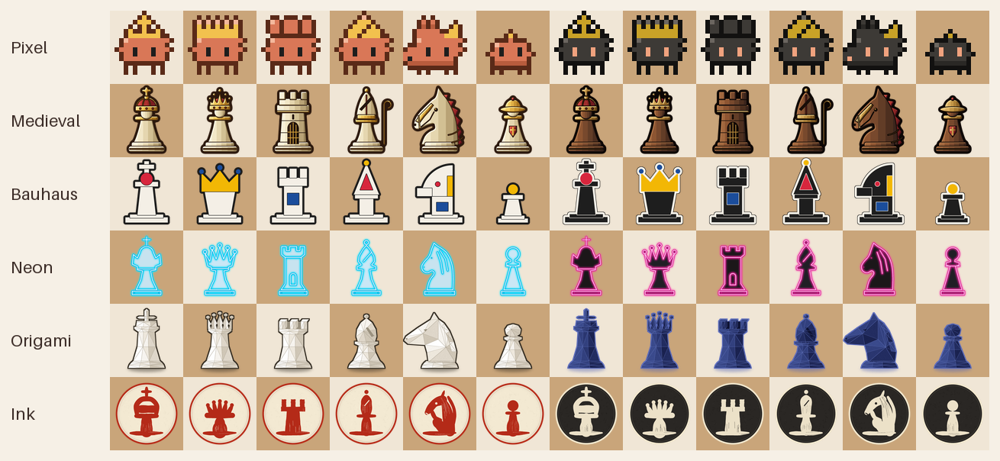

| Theme | Look | Generator |
| --- | --- | --- |
| Pixel | pixel-art creatures that blink and hop (point-sampled) | `scripts/gen_pixel_theme.py` |
| Medieval | carved ivory with gold trim against dark walnut with brass trim, crimson cloth | `scripts/gen_medieval_theme.py` |
| Bauhaus | flat modernist geometry in cream and near-black with red, yellow and blue accents | `scripts/gen_bauhaus_theme.py` |
| Neon | glowing glass-tube signs, cyan on frosted glass for White and magenta on black glass for Black | `scripts/gen_neon_theme.py` |
| Origami | low-poly folded paper, ivory against indigo | `scripts/gen_origami_theme.py` |
| Ink | sumi-e brush strokes on round tokens, vermilion on paper against chalk on black lacquer | `scripts/gen_ink_theme.py` |

Regenerate a theme with `python3 scripts/gen_<id>_theme.py` (Python 3 with Pillow 10.1 or newer; the committed files were produced with 12.1). `--out DIR` sets the output directory (default `assets/images/pieces/<id>`) and `--sheet PATH` writes a preview contact sheet. The output is deterministic, so re-running rewrites byte-identical PNGs. `python3 scripts/gen_theme_sheet.py` recomposes the overview image above from the committed pieces. All but Pixel are drawn at 4x and reduced with LANCZOS to 256x256 (sampled with mipmaps in the game), so they stay readable from full size down to about 16 px and in the greyscale Blueprint view, where the two sides differ by value.

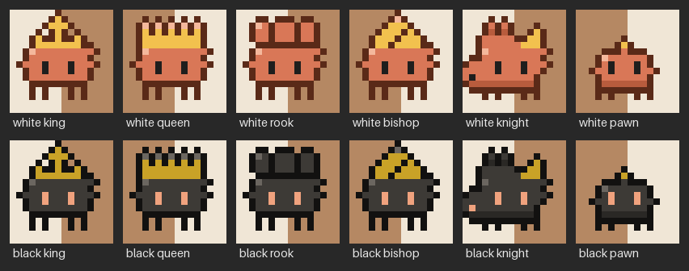

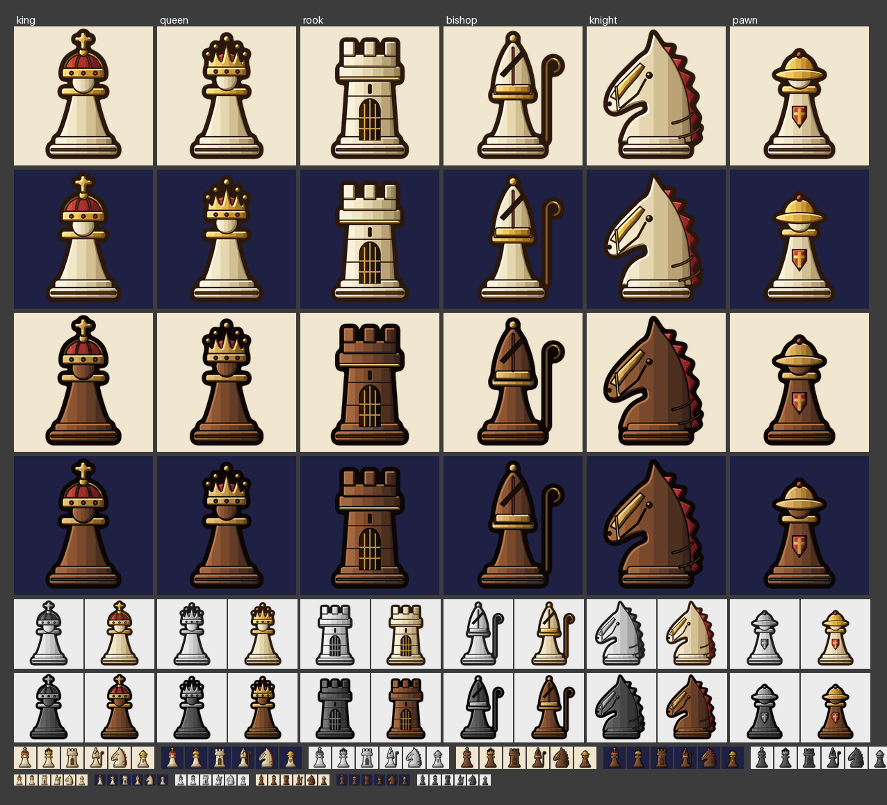

### Developer Tools
Configure with `-DFDCHESS_BUILD_TOOLS=ON` to also build `theme_preview`, which renders a scripted game and saves a screenshot:
```bash
theme_preview <Pixel|Medieval|Bauhaus|Neon|Origami|Ink> <Standard|Battle|Invasion|Fragment> <out.png> [turns] [--view "Deep space"|Atlas|Blueprint]
```
`turns` defaults to 2; `--perf` measures frame times. `ui_script` runs the real game from a script with injected input (`clicksq 0 2 g1` clicks a square by name; `mode <id>` / `position <file.5dp>` / `record <file.5dr>` open a game; `slot <n> <file>` fills a save slot): see [tests/ui/README.md](tests/ui/README.md).

### Technical Features
- **Engine without raylib**: a plain value API (`Piece`, `Board`), `.5dp` position files for the nine game modes, and a resumable background result search
- **Screens and widgets**: one `Screen` per page on a `ScreenStack`, a small widget layer, and a game screen split into `play::` modules
- **Manifest-driven assets** with loading and caching
- **Game modes as data**: add a mode by adding a `.5dp` file

## Roadmap

- ~~Official 5D Chess rules~~ (check, checkmate, stalemate, active timelines, castling, en passant, promotion choice): done.
- ~~v0.4.0~~: official rules, non-blocking result search, differential testing, `.5dp` position files, engine value API, UI screenshot tests, manifest-driven assets: done.
- ~~v0.5.0~~: widget/screen UI rewrite, three board views (Deep space, Atlas, Blueprint), official-rules visuals, promotion picker, saved settings, move notation and game records in the engine: done.
- ~~v1.0.0~~: Play vs Computer, Puzzles, the interactive Guide, save/load and six original piece themes: done.
- ~~v1.1.0~~: playability pass: calm camera with click-to-focus and keyboard navigation, layout fixes, feedback motion and sounds: done.
- **After 1.0** (ideas): online play between two browsers, more puzzles and a daily puzzle, a stronger Hard level that runs in a Web Worker, analysis mode (step through a saved game with the engine's evaluation), and cross-checking the Misc modes against 5d-chess-js.

## Known limitations

- In rare, huge positions the checkmate/stalemate search may not finish in reasonable time; the result then stays undecided ("Checking position...") and the game simply continues ([docs/SEARCH.md](docs/SEARCH.md)).
- The rules engine is cross-checked against 5d-chess-js on Standard and the Simplify modes only; the Misc modes (Time Line Invasion, Battle, Fragment) are not cross-checked.
- Hard can take a while per turn on big multiverses, several times longer in the browser than on desktop ([docs/AI.md](docs/AI.md)); Easy and Normal answer quickly.
- The computer is a material engine with a shallow search (see the limits in [docs/AI.md](docs/AI.md)): Hard is a real opponent for a beginner, not for an expert. Hard can take several seconds a turn on big multiverses, and the browser is slower than the desktop build.
- Saves hold the submitted turns only (unsubmitted moves of the current turn are not saved). There are three slots and one autosave, no naming; the web build keeps them in the browser's localStorage and has no Copy / Paste record (a page cannot read the clipboard).

## Troubleshooting

### Build issues

- **`raylib.h`/X11/GL headers missing on Linux**: install the apt packages listed under Prerequisites.
- **CMake too old** (`cmake_minimum_required` error): install CMake 3.28+ (`pip install cmake` or Kitware's apt repository).
- **raylib download fails (offline/proxy)**: install raylib >= 5.0 system-wide (`brew install raylib`, or your distro package) and re-run CMake with a clean build directory.
- **Stale configuration**: delete the build directory and configure again.

### Runtime issues

- **Missing assets**: the `assets/` folder must sit next to the executable. CMake copies it after the build; packaged ZIPs include it.
- **Window doesn't open**: check graphics drivers (OpenGL 3.3 is required). Headless machines need a display, e.g. `xvfb-run -a ./build/5dchess`.
- **Performance issues**: lower the FPS limit in `main.cpp` or reduce texture sizes in `assets/images/`.

## Contributing

1. Fork the repository
2. Create a feature branch (`git checkout -b feature/amazing-feature`)
3. Commit your changes (`git commit -m 'Add amazing feature'`)
4. Push to the branch (`git push origin feature/amazing-feature`)
5. Open a Pull Request

### Code Style
- Use C++20 standards
- Follow the existing naming conventions
- Document new classes and methods
- Maintain the established design patterns

### Testing
- Run `ctest` (see Tests above) before submitting; CI runs it on Linux, macOS and Windows
- Verify all menu interactions work correctly
- Ensure no memory leaks with new features

## License

The source code is released under the [MIT License](LICENSE). It started as an academic assignment for the Object-Oriented Programming course at HCMUS.

Assets keep their own licences, listed in [assets/CREDITS.md](assets/CREDITS.md): the music and sound effects are CC0, the fonts are under the SIL Open Font License, and the Pixel and Medieval piece themes are original to this project. The provenance of piece themes 0–2 and some board images is unknown, so they are not covered by the MIT licence.

## Credits

The sound effects and music are CC0 / public domain; fonts are under the SIL Open Font License. See [assets/CREDITS.md](assets/CREDITS.md) for the full list of sources and licences.

## Acknowledgments

- **Raylib**: Graphics and audio library
- **HCMUS**: University of Science, VNU-HCM
- **Course**: Object-Oriented Programming (OOP)

---

For questions or issues, please open an issue on the GitHub repository or contact the development team.
